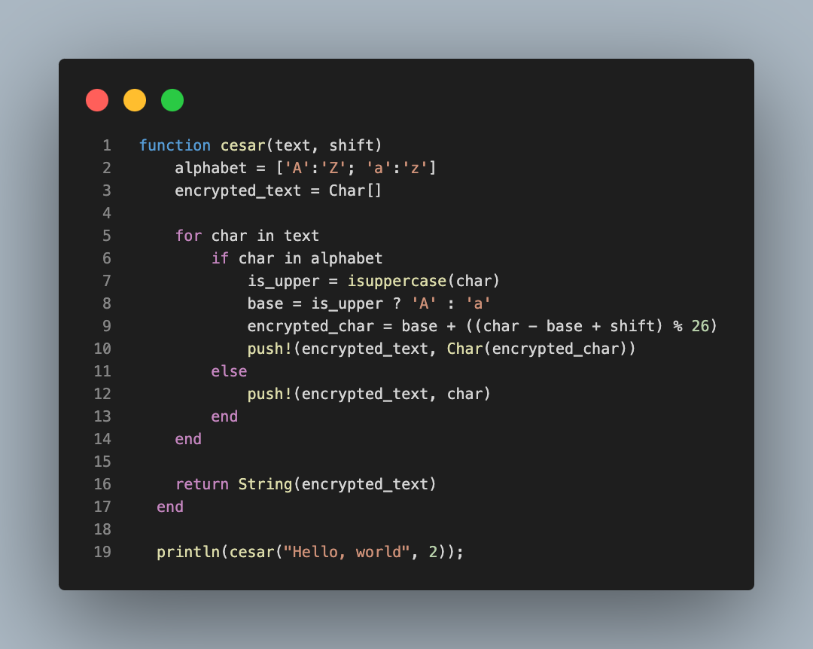
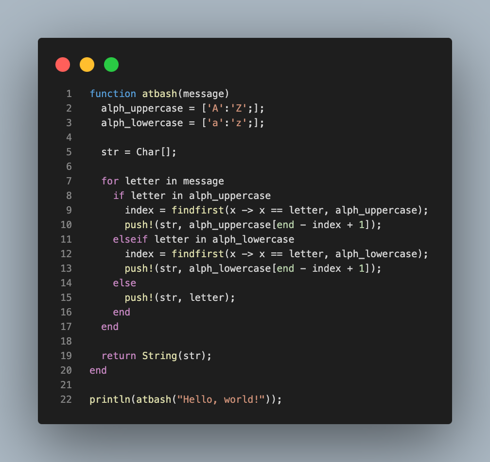

---
## Front matter
title: "Лабораторная работа № 1"
subtitle: "Математические основы защиты информации и информационной безопасности"
author: "Кузнецов Юрий Владимирович"

## Generic options
lang: ru-RU
toc-title: "Содержание"

## PDF output format
toc: true # Table of contents
toc-depth: 2
fontsize: 12pt
linestretch: 1.5
papersize: a4
documentclass: scrreprt

## I18n
polyglossia-lang:
  name: russian
  options:
    - spelling=modern
    - babelshorthands=true
polyglossia-otherlangs:
  name: english

## Fonts
mainfont: PT Serif
romanfont: PT Serif
sansfont: PT Sans
monofont: PT Mono
mainfontoptions: Ligatures=TeX
romanfontoptions: Ligatures=TeX
sansfontoptions: Ligatures=TeX,Scale=MatchLowercase
monofontoptions: Scale=MatchLowercase,Scale=0.9

## Biblatex
biblatex: true
biblio-style: "gost-numeric"
biblatexoptions:
  - parentracker=true
  - backend=biber
  - hyperref=auto
  - language=auto
  - autolang=other*
  - citestyle=gost-numeric
---

# Введение

В данной лабораторной работе будут описаны и реализованы на языке Julia основные концепции шифров "Цезаря" и "Атбаш"

## Основные темы

- Шифр "Цезаря"
- Шифр "Атбаш"

# Теоретическое введение

## Шифр "Цезаря"

В основе функционирования шифров простой замены лежит следующий
принцип: для получения шифротекста отдельные символы или группы символов
исходного алфавита заменяются символами или группами символов шифроалфавита.

Шифр Цезаря (также он является шифром простой замены) - это моноалфавитная подстановка, т.е. каждой букве открытого текста ставится в соответствие одна буква шифртекста. На практике при создании шифра простой замены в качестве шифроалфавита берется исходный алфавит, но с нарушенным порядком букв (алфавитная перестановка). Для запоминания нового порядка букв перемешивание алфавита осуществляется с помощью пароля. В качестве
пароля могут выступать слово или несколько слов с неповторяющимися буквами. Шифровальная таблица состоит из двух строк: в первой записывается стандартный алфавит открытого текста, во второй - начиная с некоторой позиции размещается пароль (пробелы опускаются), а далее идут в алфавитном порядке оставшиеся буквы, не вошедшие впароль.
Вслучае несовпадения начала пароля с началом строки процесс после ее завершения циклически продолжается с первой
позиции. Ключом шифра служит пароль вместе с числом, указывающим положение начальной буквы пароля. 

## Шифр "Атбаш"

Данный шифр является шифром сдвига на всю длину алфавита. Для
алфавита, состоящего только из русских букв и пробела.

# Ход работы

Программная реализация шифра "Цезаря"

В ходе реализации шифра была создана функция, которая принимает такие аргументы как: сообщение, которое требуется зашифровать, а также ключ, по которому будет осуществлено шифрование

{ width=70% }

Программная реализация шифра "Атбаш"

В отличие от шифра цезаря, шифр "Атбаш" не требует ключа для шифрования строки, соответственно, ниже также была описана функция, принимающая в себя 1 аргумент (строку)

{ width=70% }

# Заключение

В ходе выполнения лабораторной работы были закреплены навыки программирования на языке Julia, а также реализованы на ранее упомянутом языке программирования шифры "Цезаря" и "Атбаш".